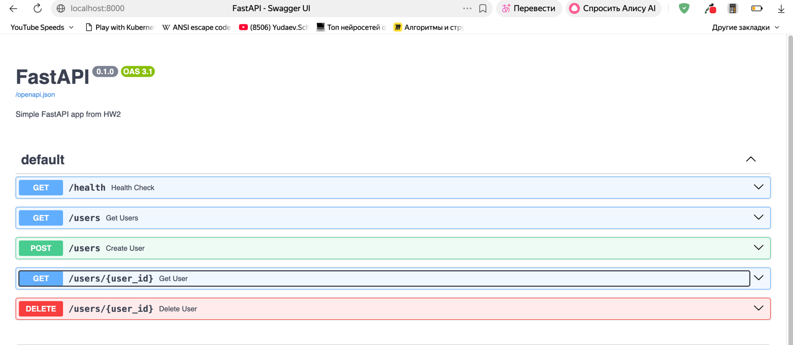

## HW2. Multi-Container Application with Docker Compose

> [!NOTE]
> This homework assignment is based on the previous one. That's why in the git log it looks just like a continuation.

> [!TIP]
> To see all works in this repository, please check the [master branch](../../tree/master).

### Homework task

- Extend the application into a multi-container application.
- Create a docker-compose.yml configuration.
- Configure application and database services.
- Configure communication between containers.
- Use environment variables for service configuration.
- Configure volumes for persistent data.
- Demonstrate that data remains available after containers are restarted.
- Run and manage the complete application using Docker Compose.

### How to run homework assigment

1. Create `,env`, you can just copy the `.env.example` file and rename it to `.env`

2. Migrate the db
   Firstly you need to migrate the database

```bash
docker compose up -d db
```

Then
> Yes, sometimes (f.e. in Django apps) the migration is built inside the docker CMD or ENTRYPOINT, but in this case I decided to do it outside of the docker container, because it is a simple app and I wanted to show you how to do it in a more "manual" way.

```bash
pip install uv
uv sync --no-dev
alembic upgrade head
```

3. Run the application

```bash
docker compose up --build
```

4. Accessing the application

- The application will be available at `http://localhost:8000/docs`
  

There were added a few new endpoints to the application. In the docker file there is a persistent-mounted volume for the
db.
