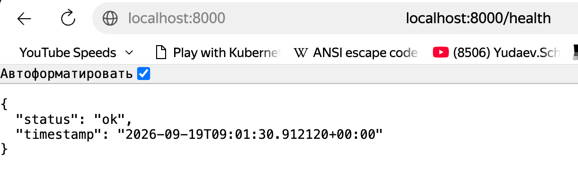

## HW1. Docker Fundamentals and Application Containerization

### Homework task
- Containerize a web application using Docker.
- Create a Dockerfile for the application.
- Build and run the Docker image.
- Configure ports and environment variables.
- Use basic Docker CLI commands to manage images and containers.
- Apply appropriate Dockerfile instructions and image optimization practices.
- Demonstrate that the application runs correctly inside a container.

### How to run homework assigment
1. Building 
```bash
 docker build -t webdev/hw1 .
```

2. Running
```bash
docker run --rm -eSERVICE_HOST="0.0.0.0" -eSERVICE_PORT=8000 -p 8000:8000 --name webdev-hw1 webdev/hw1 
```

3. Accessing

After running the container we can access the application by `localhost:8000`
F.e. `localhost:8000/docs` for Swagger UI




4. Stopping
As we run the container without `detached` mode and with `--rm` option we can just 
enter `Ctrl+C` to stop the container and remove it.

Or with 
```bash
docker stop webdev-hw1
```